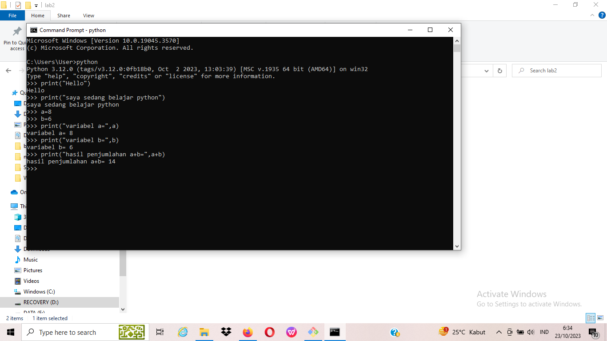
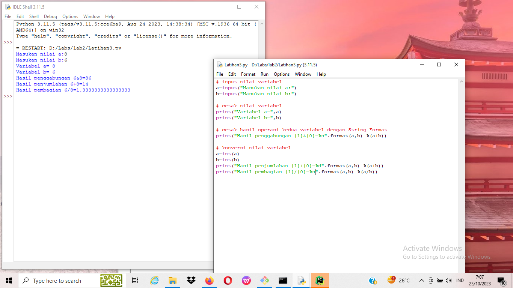
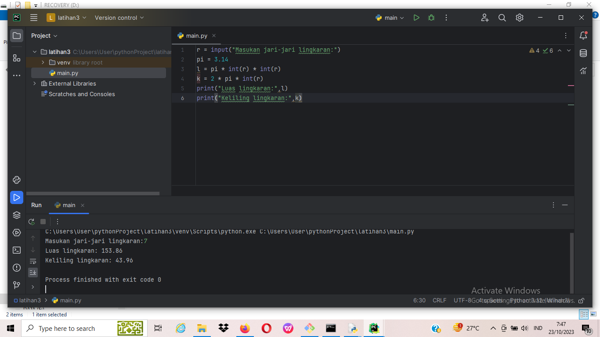

# labpy2
## Bahasa Pemrograman Python
### Langkah-langkah

buka cmd menampilkan tulisan "hello" "saya sedang belajar python"

buka idle, buat file baru rename

download pycharm, new project, rename main.py, and run

